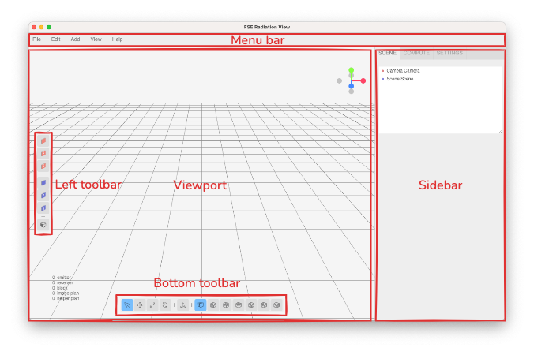
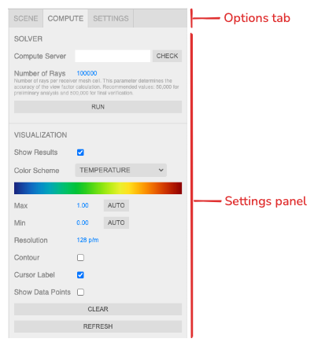
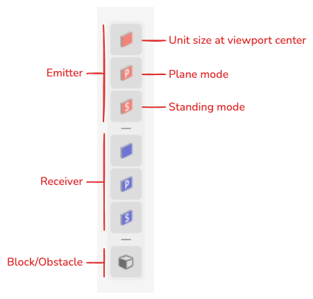
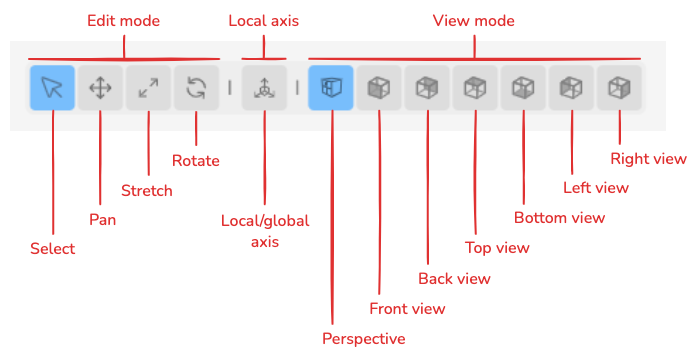

# User Interface and Interaction

This page describes the organisation of the FSE Radiation View interface and outlines an efficient operating sequence for building, editing, and reviewing radiation heat transfer models.

The interface is arranged around the main 3D viewport and is divided into four primary regions:

* **Top Menu Bar:** File operations and application-level commands.
* **Sidebar:** Object properties, scene settings, and solver controls.
* **Left Toolbar:** Object-creation tools for rapid model setup.
* **Bottom Toolbar:** View control, transformation modes, and axis options.

## Top Menu Bar

The top menu bar contains commands that apply to the project as a whole rather than to a single selected object.

Typical uses include:

* opening, saving, and managing project files
* importing plans or reference images
* exporting reports and other project outputs
* accessing application-level settings and secondary tools

## Sidebar

The sidebar is the principal location for precise numerical input and model review. Depending on the current selection, it is used to:

* enter exact coordinates and dimensions
* assign thermal and material properties
* define receiver mesh size and other solver inputs
* run the calculation and refresh the displayed results

As a general rule, objects are created and positioned visually in the viewport, then refined quantitatively in the sidebar.

## Left Toolbar

The left toolbar provides direct access to object-creation tools, including:

* **Emitters** and **Receivers**
* **Blocks**
* plan-based surface tools: **Ep** / **Rp** for flat objects and **ES** / **RS** for standing objects

These tools are intended for rapid scene construction. A common workflow is to sketch the model using the left toolbar, then complete the detailed parameterisation in the sidebar.

## Bottom Toolbar

The bottom toolbar controls how the user interacts with the 3D scene and how objects are transformed.

### Navigation and Interaction Modes

The active mode determines what a left-click does in the viewport:

* **Select Mode:** Selects objects without applying transformations.
* **Move Mode:** Activates the translation gizmo.
* **Stretch Mode:** Activates the dimension-adjustment gizmo.
* **Rotate Mode:** Activates the rotation gizmo.

For routine navigation and inspection, **Select Mode** is generally the safest default.

### Local and Global Axes

The **Local axis** toggle determines whether transformations are aligned with the object's own axes or with the global coordinate system.

* **Local axis enabled:** Transformations follow the selected object's local orientation. This is particularly useful after an object has been rotated.
* **Local axis disabled:** Transformations follow the global scene axes.

### View Selection

The toolbar also provides preset camera views:

* **Perspective**
* **Front**
* **Back**
* **Left**
* **Right**
* **Top**
* **Bottom**

Orthographic views are particularly useful when aligning objects to a single plane, checking face orientation, or drawing geometry against an imported plan.

## Recommended Operating Sequence

For efficient and reliable model setup, the following sequence is recommended:

1. **Import references:** Load plans or images if they are needed for alignment.
2. **Create geometry:** Add emitters, receivers, and blocks using the left toolbar.
3. **Position the model:** Use orthographic views and the transformation modes to place the geometry accurately.
4. **Enter exact values:** Use the sidebar for dimensions, temperatures, emissivities, absorptivities, mesh sizes, and solver settings.
5. **Run and review:** Start the solver, inspect the heatmap, and export the results when the setup is satisfactory.
