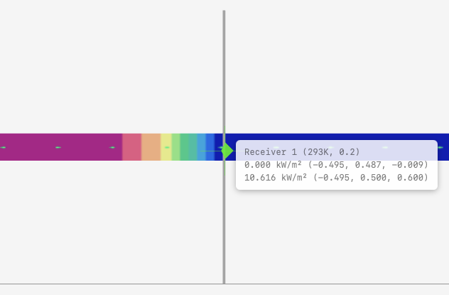
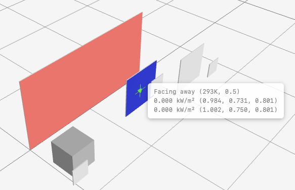
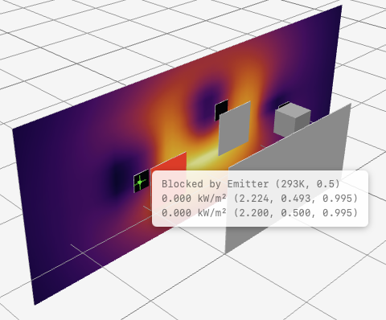
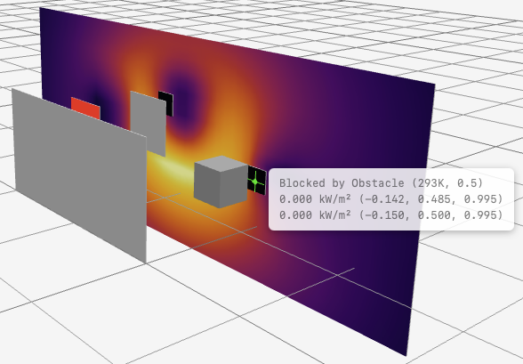
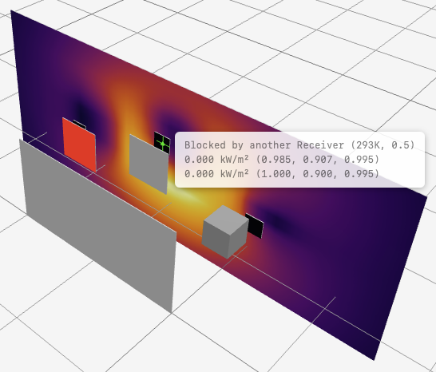

# Verification

This page documents the verification basis for FSE Radiation View. The objective is to demonstrate that the solver:

* reproduces analytical radiative benchmarks for simple geometries
* enforces front-face orientation and geometric occlusion correctly
* exhibits statistical behaviour consistent with a Monte Carlo estimator

The verification described here does not claim validation for physics that are outside the present model scope, such as reflected radiation, participating media, or secondary re-radiation from non-emitting surfaces.

## Acceptance Criteria

For the solver to be considered verified against the benchmark set below, the following criteria are adopted:

1. **Accuracy against analytical reference:** The mean predicted heat flux shall be within ±2% relative error or ±0.05 kW/m² absolute error of the analytical solution.
2. **Zero-visibility robustness:** For cases in which the emitter view factor is theoretically zero, and where $T_a = T_r$ with $\alpha_r = \epsilon_r = 1$, the reported net heat flux shall be 0.00 kW/m².

## Analytical Benchmark Cases

Analytical view-factor relations are available for simple rectangular-source geometries. These provide deterministic reference values against which the Monte Carlo solver can be checked.

The benchmark setup uses a single-cell receiver as a point approximation located at various distances from a rectangular emitter. The receiver is aligned with one corner of the emitter rather than with the centre so that the coordinate handling is tested away from a symmetry line.

For both analytical cases below:

* **Emitter:** 2 m width x 1 m height, temperature = 1103.3 K, emissivity = 1
* **Receiver:** Single-cell point approximation, temperature = 293 K, absorptivity = 1
* **Ambient:** 293 K
* **Solver setting:** 1,000,000 rays

Because the solver applies ambient radiation uniformly rather than geometrically, setting $T_a = T_r$ removes net ambient exchange from the benchmark and isolates the direct emitter contribution.

### Parallel Planes

The receiver faces directly towards the emitter and is offset normal to the emitter plane by distances from 1 m to 4 m.

| Separation Distance [m] | Deterministic [kW/m²] | Run 1 [kW/m²] | Run 2 [kW/m²] | Run 3 [kW/m²] | Mean [kW/m²] | Absolute Error [kW/m²] | Relative Error [%] |
| :--- | :--- | :--- | :--- | :--- | :--- | :--- | :--- |
| 1 | 14.06 | 14.028 | 14.027 | 14.090 | 14.048 | 0.012 | 0.08% |
| 2 | 7.58 | 7.559 | 7.594 | 7.554 | 7.569 | 0.011 | 0.15% |
| 3 | 4.39 | 4.378 | 4.380 | 4.396 | 4.385 | 0.005 | 0.11% |
| 4 | 2.78 | 2.788 | 2.804 | 2.780 | 2.791 | 0.011 | 0.40% |

### Perpendicular Planes

The receiver is aligned with one corner of the emitter and rotated by 90 degrees relative to the emitter face. Distances from the virtual intersecting edge range from 1 m to 4 m.

| Separation Distance [m] | Deterministic [kW/m²] | Run 1 [kW/m²] | Run 2 [kW/m²] | Run 3 [kW/m²] | Mean [kW/m²] | Absolute Error [kW/m²] | Relative Error [%] |
| :--- | :--- | :--- | :--- | :--- | :--- | :--- | :--- |
| 1 | 7.99 | 7.989 | 8.001 | 7.984 | 7.991 | 0.001 | 0.01% |
| 2 | 2.99 | 2.993 | 2.989 | 2.971 | 2.984 | 0.006 | 0.20% |
| 3 | 1.29 | 1.316 | 1.285 | 1.290 | 1.297 | 0.007 | 0.54% |
| 4 | 0.64 | 0.638 | 0.652 | 0.644 | 0.645 | 0.005 | 0.78% |

> **Conclusion:** All benchmark means are comfortably within the adopted acceptance criterion, indicating that the solver reproduces the analytical direct-radiation solution for the tested parallel and perpendicular configurations.

## Visibility and Occlusion Cases

The following cases verify the geometric logic of the ray-casting procedure, including face orientation, back-face rejection, and blocking behaviour. In all cases below, the direct emitter view factor is theoretically zero. Because the tests are run with $T_a = T_r$ and $\alpha_r = \epsilon_r = 1$, the uniform ambient term also cancels, so zero direct visibility gives a reported net heat flux of 0.00 kW/m².

### Receiver Behind Emitter

The receiver is located behind the emitter, outside the hemisphere associated with the emitter's active front face. The zero result confirms that emission occurs only from the designated active face.

### Receiver Facing Away From Emitter

The receiver is positioned in front of the emitter, but its active face is directed away from the source. The zero result confirms that the receiving orientation is enforced correctly.

### Receiver Blocked by Emitter

A second object lies completely between the active emitter and the receiver. The zero result confirms that the intervening geometry removes direct line of sight.

### Receiver Blocked by an Obstacle

An opaque Block object is placed directly between emitter and receiver. The zero result confirms correct ray-intersection handling for generic shielding geometry.

### Receiver Blocked by Another Receiver

A front receiver is placed between the emitter and a rear receiver. The rear receiver reports zero heat flux, confirming that receiver surfaces are treated as opaque to direct emitter rays.

## Uncertainty: Sources and Interpretation

### Sources of Uncertainty

The principal numerical uncertainties are:

1. **Monte Carlo sampling noise:** Each receiver value is estimated from a finite number of stochastic ray samples. As a first-order rule, the standard error scales approximately as

   $$
   \text{Standard Error} \propto \frac{1}{\sqrt{N}}
   $$

   where $N$ is the ray count. Doubling the ray count therefore reduces the standard error by roughly a factor of $\sqrt{2}$.

2. **Receiver discretisation:** The receiver is represented by a finite grid rather than a mathematical continuum. Smaller cells improve spatial resolution, but local fluctuations become more apparent and a higher ray count may be required to obtain a similarly smooth field.

### Repeated-Run Results (500,000 Rays)

Repeated trials were carried out using 500,000 rays per run and 10,000 runs per configuration for several parallel and perpendicular benchmark cases. The analytical result was taken as the reference value. The observed Monte Carlo error is defined as

$$
\text{Error} = q''_{\text{solver}} - q''_{\text{reference}}
$$

The repeated-run results show the following:

* **Bias:** Mean error is close to zero for all tested configurations, indicating no discernible systematic bias in the estimator.
* **Spread:** Standard deviation depends strongly on the geometry. High-view-factor cases exhibit the largest spread, typically about 0.05 to 0.06 kW/m². Lower-view-factor cases show much smaller spread, often about 0.01 kW/m².
* **Single-run outliers:** In the highest-flux cases, occasional deviations of approximately ±0.2 kW/m² can occur at 500,000 rays. Lower-flux cases show materially smaller excursions.
* **Practical implication:** A baseline of 500,000 rays is generally suitable for engineering use, but higher ray counts are warranted where small local peaks or tight acceptance margins are important.

The figure below shows the repeated-run error distributions for the validation set. Each subplot is a histogram of 10,000 runs. The red dashed line indicates the mean error and the orange dotted lines indicate ±1 standard deviation.

<ClientOnly>
  <ValidationUncertaintyChart />
  <template #fallback>
    
Loading interactive chart…

  </template>
</ClientOnly>

## Limitations of the Verification Basis

The benchmark set above provides confidence in the current implementation, but its scope should be stated clearly:

* analytical checks are limited to simple rectangular-source cases for which closed-form references are available
* zero-visibility checks verify geometry handling, not mutual radiation exchange between non-emitting surfaces
* ambient radiation is treated as a uniform background, so the verification basis does not test geometry-dependent surroundings radiation
* the verification basis does not cover reflection, participating media, or full enclosure-radiation behaviour because those effects are outside the present solver model
